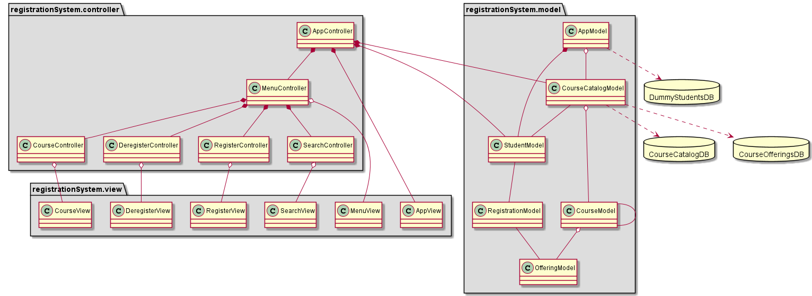

# ENSF-607 Assignment 3

An assignment on updating the Course Registration System done in [Assignment 1](https://github.com/meng-ucalgary/ensf-607-assignment-1) to include a GUI with MVC architecture.
ENSF 607 - Fall 2021

## Folder Structure

- [src](src): source code
- [lib](lib): setup data
- [screenshots](screenshots): GUI screenshots
- [uml](uml): UML diagrams and their source code

## How to build and run

1. JDK version 1.7 or above is required to build and run this program.

2. Clone the repository on your machine, or download the zip file

3. Run the [run.sh](run.sh) or [run.cmd](run.cmd) file to run the program

4. Then follow the onscreen instructions

## UML Diagrams

1. UML diagram - high level

   

2. UML diagram - detailed

   

## Screenshots

Student entering his/her details

Program menu options

Menu option 1: no search results

Menu option 1: search produced some results

Menu option 2: couldn't register as all registrations are full in this offering

Menu option 2: couldn't register as pre-requisites are not met

Menu option 2: successfully registered

Menu option 2: successfully registered but a warning is issued

Menu option 2: cannot register for more than 6 courses

Menu option 3: cannot de-register as registered courses has depedency

Menu option 3: successfully de-registered

Menu option 4: view the entire course catalog

Menu option 5: show all the registered courses for the current student

Menu option 6: exit the program

